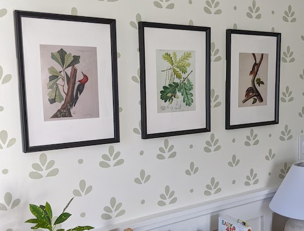
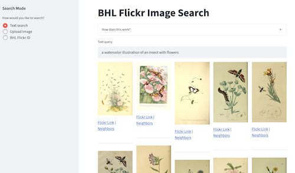
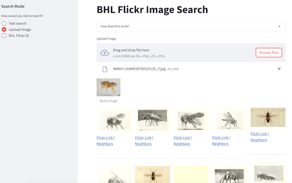
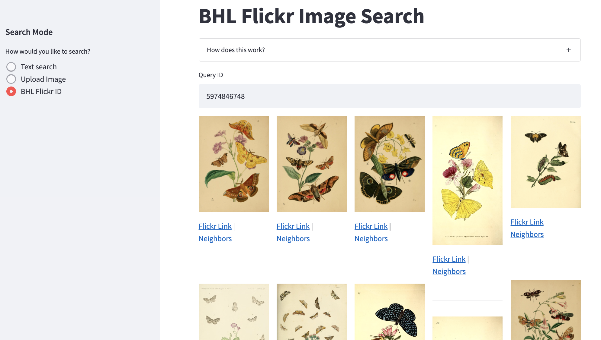

# BHL Flickr Search App

This is a Streamlit app that enables a user to search [the over 300,000 open access images on the Biodiversity Heritage Library Flickr](https://www.flickr.com/photos/biodivlibrary/albums/) using natural language queries.

I built this to pick out a few prints for my son's nursery ... and also to test out some new tools and workflows that I can use on other datasets.

## Search modes

### Text search

### Image search

### Neighbor search

## How this works

## Set up locally

